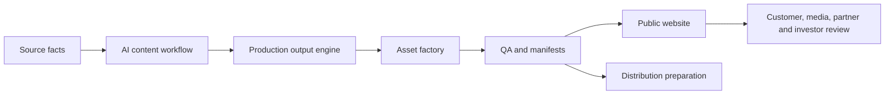

# Why L3AI - Public Marketing Story 022

## One-sentence Story

L3AI helps people understand complex Web3 and AI-finance information before they act, while giving operators a source-backed, review-gated, bilingual launch system for public materials.

## The Problem

Web3 and AI-finance products often fail at the point of understanding:

- Market information is fragmented.
- Product language is technical.
- Wallet context is hard to explain safely.
- Public claims can drift from approved facts.
- Launch assets are often scattered across folders, chats and ad hoc files.

## The L3AI Answer

L3AI turns that chaos into a structured public experience:

- Explain the product in plain language.
- Keep risk and advice boundaries visible.
- Separate current capabilities from roadmap.
- Package whitepaper, deck, video, FAQ and media resources into one public center.
- Maintain manifests so assets are traceable.

## Operating Proof

The current public package demonstrates an end-to-end launch production workflow:

## Why This Matters

Most public launch packages show finished files. L3AI shows the operating system behind them:

- Content has a source boundary.
- Assets are versioned.
- Public URLs are verifiable.
- Risk language is explicit.
- Execution and publishing remain separated from preparation.

## Audience Paths

| Audience | What they need | Best starting point |
| --- | --- | --- |
| First-time customer | Simple explanation and risk boundary | Resources guided path and FAQ |
| Partner | Product narrative and operating proof | Whitepaper, Alpha Engine pack, media kit |
| Investor | Commercial model and roadmap | Business plan / investor deck |
| Media | Public-safe descriptions and assets | Media kit, press kit, FAQ |
| Operator | Completeness and release evidence | Public asset manifest and package manifests |

## Core Messages

1. L3AI is built for understanding before action.
2. L3AI is source-backed and review-gated.
3. L3AI public materials are bilingual and traceable.
4. Alpha Engine is a paper-only AI quant research operating-system prototype.
5. The public launch system is prepared, but external publishing and production execution stay controlled.

## CTA

Start with the resource center, then choose the whitepaper, business plan deck, Alpha Engine pack, promo video or FAQ based on your review role.
